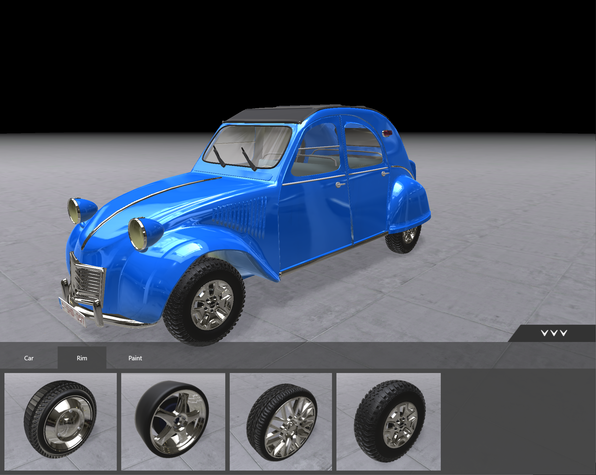
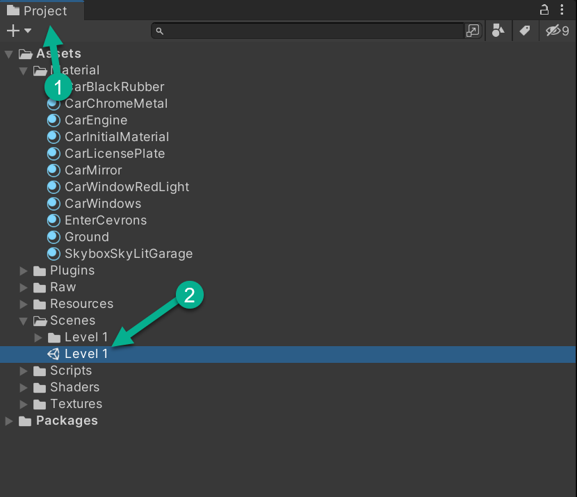
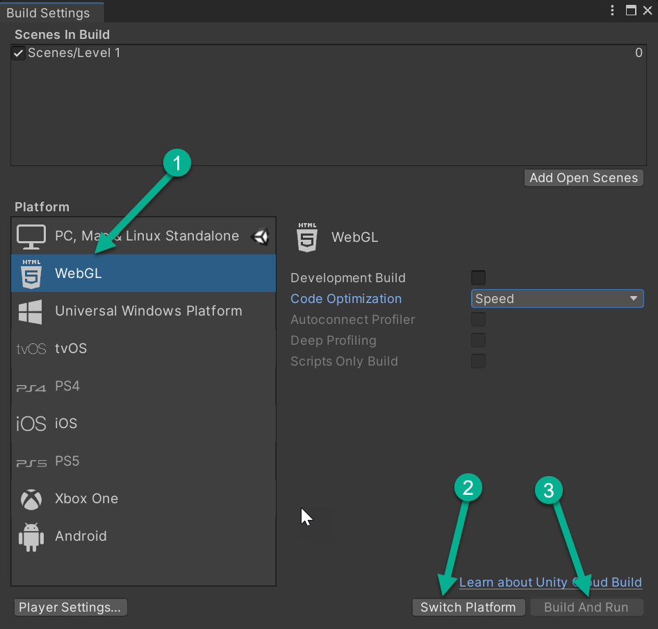
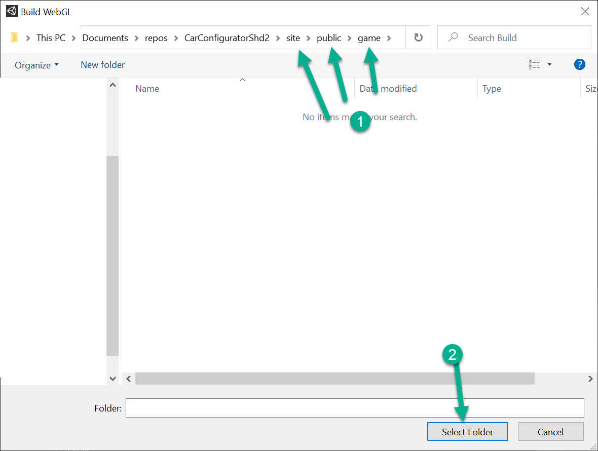

# Car Configurator

Unity project to configure a car
The configuration bar is built in html which communicates with Unity in 2 directions.

[Demo](http://bertyhell.s3-website.eu-central-1.amazonaws.com/projects/car-configurator-shd)



## Development

Clone the repo

## Unity part of the site:
Open the game folder in Unity

Open level 1:


Open build settings from the unity file menu
* Select the WebGL platform
* Click the "Switch Platform" button
* Click the "Build And Run" button

  
Select the folder: site\public\game


Wait for the build to finish.

## React part of the site:

navigate to /site
make sure you have [NodeJS](https://nodejs.org/) installed
open a command line, navigate to the site folder and install the project dependencies:
```
npm install
```

run the site using the start command:
```
npm run start
```

The site should not be available in the browser under:
```
http://localhost:3000
```
