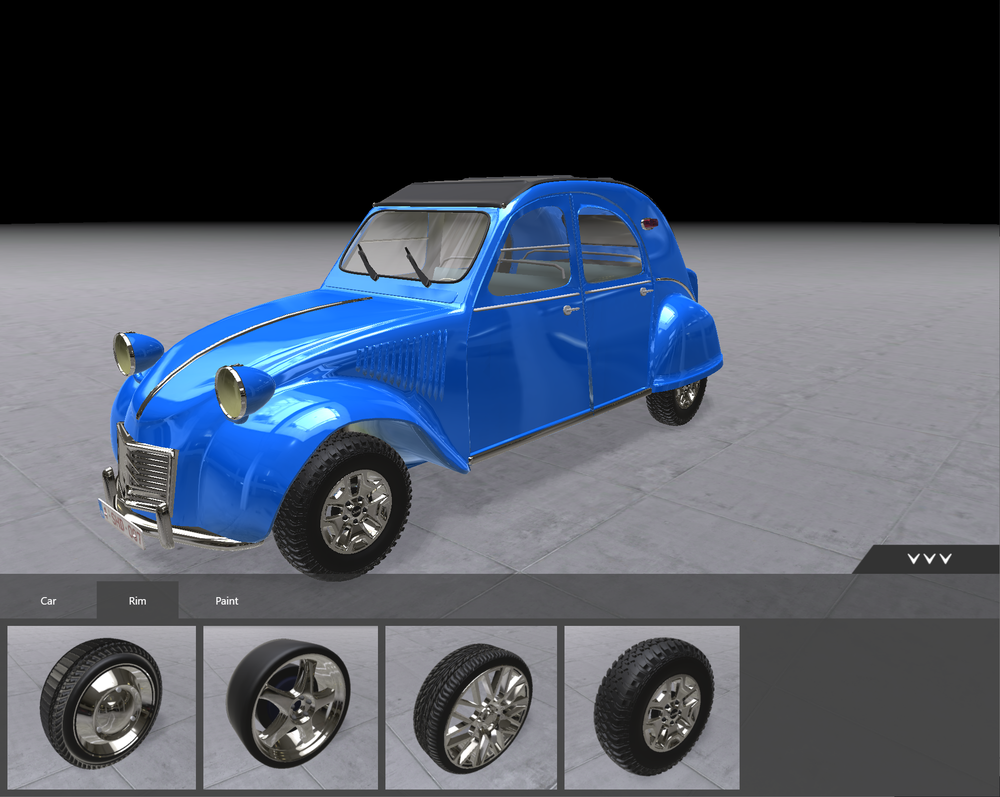

# Car Configurator

Unity project to configure a car
The configuration bar is built in html which communicates with Unity in 2 directions.

[Demo](http://bertyhell.s3-website.eu-central-1.amazonaws.com/projects/car-configurator-shd)



## Development

Clone the repo

## Unity part of the site:
Open Unity and build the project for the web target. Then copy the build folder to:
```
site/public/game
```

This file should then exist at this location:
```
site/public/game/Build/game.loader.js
```

## React part of the site:

navigate to /site
make sure you have nodeJS installed
install the project dependencies:
```
npm install
```

run the site using the start command:
```
npm run start
```

The site should not be available in the browser under:
```
http://localhost:3000
```
